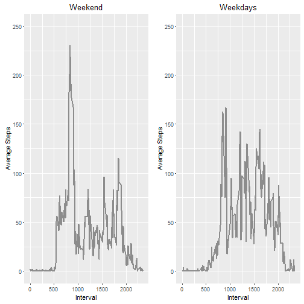

# Required libraries


```r
#install.packages("dplyr")
library(dplyr)
```

```
## Warning: package 'dplyr' was built under R version 3.1.3
```

```
## 
## Attaching package: 'dplyr'
```

```
## The following objects are masked from 'package:stats':
## 
##     filter, lag
```

```
## The following objects are masked from 'package:base':
## 
##     intersect, setdiff, setequal, union
```

```r
#install.packages("devtools")
library(devtools)
```

```
## Warning: package 'devtools' was built under R version 3.1.3
```

```r
#install_github("easyGgplot2", "kassambara")
library(easyGgplot2)
```

```
## Loading required package: ggplot2
```

```
## Warning: package 'ggplot2' was built under R version 3.1.3
```

```r
library(ggplot2)
source("http://peterhaschke.com/Code/multiplot.R")
setwd("C:/Users/Pol/Documents/R")
```

# Code for reading in the dataset and/or processing the data


```r
data <- read.csv("C:/Users/Pol/Documents/R/activity.csv")
str(data)
```

```
## 'data.frame':	17568 obs. of  3 variables:
##  $ steps   : int  NA NA NA NA NA NA NA NA NA NA ...
##  $ date    : Factor w/ 61 levels "2012-10-01","2012-10-02",..: 1 1 1 1 1 1 1 1 1 1 ...
##  $ interval: int  0 5 10 15 20 25 30 35 40 45 ...
```

```r
dim(data)
```

```
## [1] 17568     3
```


# Histogram of the total number of steps taken each day

NA entries removed in the new dataset named **data_steps_yes** 


```r
data_steps_yes <- data[!is.na(data$steps),]
data_steps_na <- data[is.na(data$steps),]
nrow(data) == nrow(data_steps_yes) + nrow(data_steps_na)
```

```
## [1] TRUE
```

```r
data_steps_yes_perday <- group_by(data_steps_yes, date)
data_steps_yes_perday <- summarise(data_steps_yes_perday,sum_steps = sum(steps))
data_steps_yes_perday$date <- as.Date(data_steps_yes_perday$date)

ggplot(data_steps_yes_perday,aes(x=date,y=sum_steps)) + 
  geom_bar(colour="black", fill="#DD8888", width=.4,stat="identity") +
  guides(fill=FALSE) +
  xlab("Date") + ylab("Total Steps") +
  ggtitle("Histogram")
```


  

# Mean and median number of steps taken each day


```r
data_steps_yes_perday_M <- group_by(data_steps_yes, date)
data_steps_yes_perday_M <- summarise(data_steps_yes_perday_M,M_steps = mean(steps))
data_steps_yes_perday_M$date <- as.Date(data_steps_yes_perday_M$date)

data_steps_yes_perday_MD <- group_by(data_steps_yes, date)
data_steps_yes_perday_MD <- summarise(data_steps_yes_perday_MD,MD_steps = median(steps))
data_steps_yes_perday_MD$date <- as.Date(data_steps_yes_perday_MD$date)

summary(data_steps_yes_perday_M)
```

```
##       date               M_steps       
##  Min.   :2012-10-02   Min.   : 0.1424  
##  1st Qu.:2012-10-16   1st Qu.:30.6979  
##  Median :2012-10-29   Median :37.3785  
##  Mean   :2012-10-30   Mean   :37.3826  
##  3rd Qu.:2012-11-16   3rd Qu.:46.1597  
##  Max.   :2012-11-29   Max.   :73.5903
```

```r
head(data_steps_yes_perday_M)
```

```
## Source: local data frame [6 x 2]
## 
##         date  M_steps
##       (date)    (dbl)
## 1 2012-10-02  0.43750
## 2 2012-10-03 39.41667
## 3 2012-10-04 42.06944
## 4 2012-10-05 46.15972
## 5 2012-10-06 53.54167
## 6 2012-10-07 38.24653
```

```r
summary(data_steps_yes_perday_MD)
```

```
##       date               MD_steps
##  Min.   :2012-10-02   Min.   :0  
##  1st Qu.:2012-10-16   1st Qu.:0  
##  Median :2012-10-29   Median :0  
##  Mean   :2012-10-30   Mean   :0  
##  3rd Qu.:2012-11-16   3rd Qu.:0  
##  Max.   :2012-11-29   Max.   :0
```

```r
head(data_steps_yes_perday_MD)
```

```
## Source: local data frame [6 x 2]
## 
##         date MD_steps
##       (date)    (dbl)
## 1 2012-10-02        0
## 2 2012-10-03        0
## 3 2012-10-04        0
## 4 2012-10-05        0
## 5 2012-10-06        0
## 6 2012-10-07        0
```


# Time series plot of the average number of steps taken

```r
data_steps_yes_interval_M <- group_by(data_steps_yes, interval)
data_steps_yes_interval_M <- summarise(data_steps_yes_interval_M,M_int = mean(steps))

ggplot(data_steps_yes_interval_M,aes(x=interval,y=M_int)) + 
  geom_line(colour="gray55", linetype="solid", size=1) + 
    xlab("Interval") + ylab("Average Steps") +
  ggtitle("Time Series") 
```


# The 5-minute interval that, on average, contains the maximum number of steps


```r
data_steps_yes_interval_M_max <- data_steps_yes_interval_M[data_steps_yes_interval_M$M_int == max(data_steps_yes_interval_M$M_int),]
data_steps_yes_interval_M_max
```

```
## Source: local data frame [1 x 2]
## 
##   interval    M_int
##      (int)    (dbl)
## 1      835 206.1698
```
Interval with max number of steps is **835**


# Code to describe and show a strategy for imputing missing data

Use **data_steps_yes_interval_M** dataset for intervals with missing data and later append results to the  original dataset **data_steps_yes** where NA has been removed 


```r
data_steps_na_filled <- merge(data_steps_na,data_steps_yes_interval_M,by = "interval")
data_steps_na_filled <- data_steps_na_filled[-c(2)]
data_steps_na_filled <- data_steps_na_filled[c(3,2,1)]
colnames(data_steps_na_filled)[1] <- "steps"

data_steps_all_filled <- rbind(data_steps_yes,data_steps_na_filled)
nrow(data_steps_all_filled) == nrow(data)
```

```
## [1] TRUE
```


# Histogram of the total number of steps taken each day after missing values are imputed

```r
data_steps_all_filled_s <- group_by(data_steps_all_filled, date)
data_steps_all_filled_s <- summarise(data_steps_all_filled_s,sum_steps = sum(steps))
data_steps_all_filled_s$date <- as.Date(data_steps_all_filled_s$date)

ggplot(data_steps_all_filled_s,aes(x=date,y=sum_steps)) + 
  geom_bar(colour="black", fill="#DD8888", width=.4,stat="identity") +
  guides(fill=FALSE) +
  xlab("Date") + ylab("Total Steps") +
  ggtitle("Histogram")
```


# Calculate and report the mean and median total number of steps taken per day

```r
data_steps_all_filled_M <- group_by(data_steps_all_filled, date)
data_steps_all_filled_M <- summarise(data_steps_all_filled_M,M_steps = mean(steps))
data_steps_all_filled_M$date <- as.Date(data_steps_all_filled_M$date)

data_steps_all_filled_MD <- group_by(data_steps_all_filled, date)
data_steps_all_filled_MD <- summarise(data_steps_all_filled_MD,MD_steps = median(steps))
data_steps_all_filled_MD$date <- as.Date(data_steps_all_filled_MD$date)

Mean_original_dataset <- summary(data_steps_yes_perday_M)
Median_original_dataset <- summary(data_steps_yes_perday_MD)

Mean_filled_dataset <- summary(data_steps_all_filled_M)
Median_filled_dataset <- summary(data_steps_all_filled_MD)
```

Interval with max number of steps is **835**

**Original dataset**

**Mean:** Min.   :2012-10-02  , 1st Qu.:2012-10-16  , Median :2012-10-29  , Mean   :2012-10-30  , 3rd Qu.:2012-11-16  , Max.   :2012-11-29  , Min.   : 0.1424  , 1st Qu.:30.6979  , Median :37.3785  , Mean   :37.3826  , 3rd Qu.:46.1597  , Max.   :73.5903  
**Median:** Min.   :2012-10-02  , 1st Qu.:2012-10-16  , Median :2012-10-29  , Mean   :2012-10-30  , 3rd Qu.:2012-11-16  , Max.   :2012-11-29  , Min.   :0  , 1st Qu.:0  , Median :0  , Mean   :0  , 3rd Qu.:0  , Max.   :0  

**Filled-in dataset**

**Mean:** Min.   :2012-10-01  , 1st Qu.:2012-10-16  , Median :2012-10-31  , Mean   :2012-10-31  , 3rd Qu.:2012-11-15  , Max.   :2012-11-30  , Min.   : 0.1424  , 1st Qu.:34.0938  , Median :37.3826  , Mean   :37.3826  , 3rd Qu.:44.4826  , Max.   :73.5903  
**Median:** Min.   :2012-10-01  , 1st Qu.:2012-10-16  , Median :2012-10-31  , Mean   :2012-10-31  , 3rd Qu.:2012-11-15  , Max.   :2012-11-30  , Min.   : 0.000  , 1st Qu.: 0.000  , Median : 0.000  , Mean   : 4.474  , 3rd Qu.: 0.000  , Max.   :34.113  

No impact to mean values

Median values are **higher** in filled-in dataset


# Panel plot comparing the average number of steps taken per 5-minute interval across weekdays and weekends


```r
data_steps_all_filled_daytype <- transform(data_steps_all_filled,flag_weekend = (weekdays(as.Date(date)) %in% c('Saturday','Sunday')))
data_steps_all_filled_Week <- data_steps_all_filled_daytype[data_steps_all_filled_daytype$flag_weekend==TRUE,]
data_steps_all_filled_Weekend <- data_steps_all_filled_daytype[data_steps_all_filled_daytype$flag_weekend==FALSE,]


data_steps_all_filled_Weekend_M <- group_by(data_steps_all_filled_Weekend, interval)
data_steps_all_filled_Weekend_M <- summarise(data_steps_all_filled_Weekend_M,M_int = mean(steps))

g1 <- ggplot(data_steps_all_filled_Weekend_M,aes(x=interval,y=M_int)) + 
  geom_line(colour="gray55", linetype=1, size=1) + 
  #geom_point(colour="green", size=1, shape=16) +
  xlab("Interval") + ylab("Average Steps") +
  ggtitle("Weekend") +
  scale_y_continuous(limits = c(0, 250))


data_steps_all_filled_Week_M <- group_by(data_steps_all_filled_Week, interval)
data_steps_all_filled_Week_M <- summarise(data_steps_all_filled_Week_M,M_int = mean(steps))

g2<- ggplot(data_steps_all_filled_Week_M,aes(x=interval,y=M_int)) + 
  geom_line(colour="gray55", linetype=1, size=1) + 
  #geom_point(colour="green", size=1, shape=16) +
  xlab("Interval") + ylab("Average Steps") +
  ggtitle("Weekdays") +
  scale_y_continuous(limits = c(0, 250))

multiplot(g1,g2, cols=2)
```

```
## Loading required package: grid
```



  
